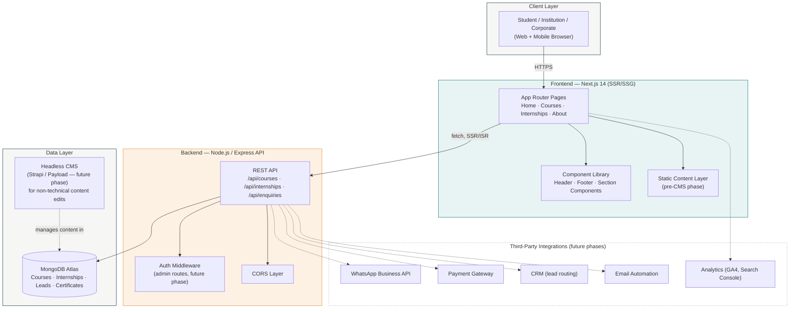
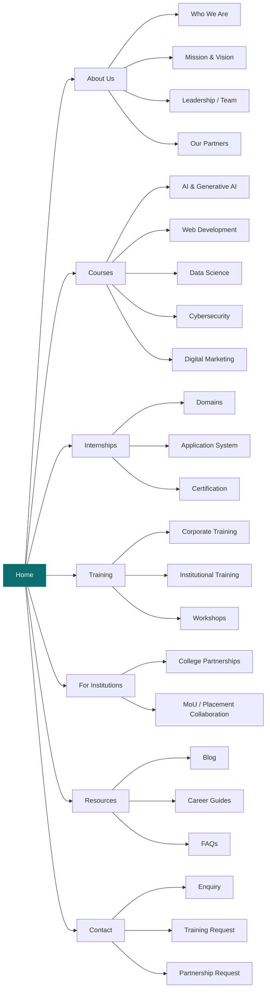
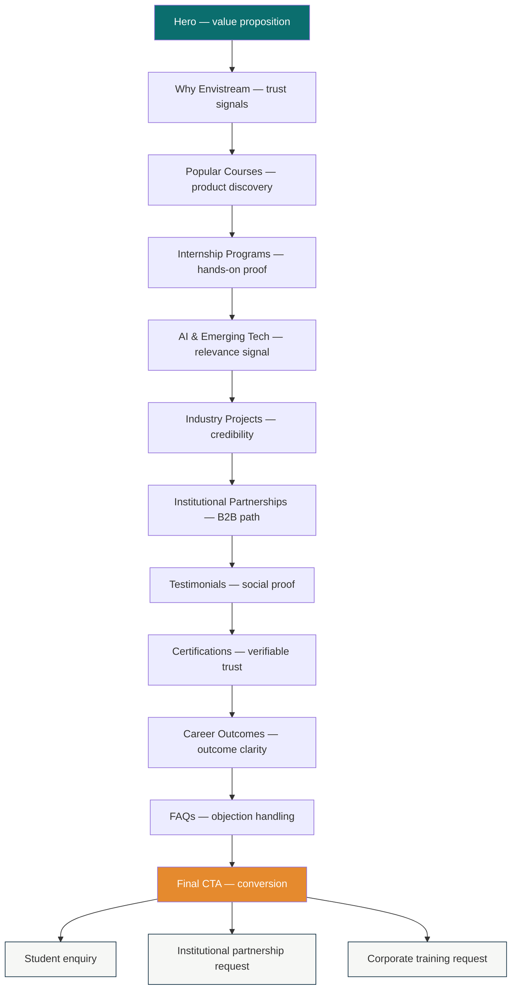
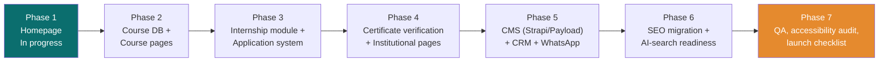

# Envistream EduSkill

**A modern digital education and career platform** — built to attract
students, convert enquiries, support internships and training programs,
build institutional partnerships, and establish Envistream EduSkill as a
recognized authority in technology and career-oriented education.

Live site (current, pre-revamp): [envistream.org](https://envistream.org)

> **Note on scope:** Envistream EduSkill currently operates from a single
> office in Bhubaneswar, India, serving Indian students and institutions.
> This platform is architected to scale beyond that (SSR, CDN delivery,
> AI-search-ready content) — but this README describes the platform as it
> is being built, not a claim of existing international operations.

---

## Table of contents

- [About](#about)
- [System architecture](#system-architecture)
- [Site structure](#site-structure)
- [Conversion funnel](#conversion-funnel)
- [Tech stack](#tech-stack)
- [Repository structure](#repository-structure)
- [Getting started](#getting-started)
- [Environment variables](#environment-variables)
- [Design system](#design-system)
- [Known issues to resolve before launch](#known-issues-to-resolve-before-launch)
- [Roadmap](#roadmap)
- [Contact](#contact)

---

## About

Envistream EduSkill provides industry-oriented training, internships,
certifications and career development programs across technology and
management domains.

**Programs:** Artificial Intelligence & Generative AI · Machine Learning /
Data Science · Web Development (React, Node.js) · Software Testing &
Cypress Automation · ERP / SAP Training · Cybersecurity & Cloud Computing ·
Digital Marketing (SEO, SEM, AEO)

**Audiences served:** students (school through postgraduate), parents,
educational institutions (colleges, universities, placement cells),
corporate clients (HR/L&D teams, IT companies, SMEs), and training/industry
partners.

**Project mandate:** rebuild the site as an SEO-first, AI-search-ready,
mobile-first, conversion-focused platform — not a visual reskin of the
existing pages.

```
Brand → UX → Content → SEO → AI Search → Lead Generation →
Student Conversion → Institutional Partnerships
```

---

## System architecture



**Why SSR (Next.js) over a plain React SPA:** search crawlers and AI
retrieval bots (Googlebot, GPTBot, PerplexityBot) largely read raw HTML.
A client-only React app renders content after JavaScript executes, which
most crawlers don't reliably wait for — that would work directly against
the SEO/AI-search mandate above.

---

## Site structure



---

## Conversion funnel

What each homepage section is responsible for, in sequence:



---

## Tech stack

| Layer | Choice | Why |
|---|---|---|
| Frontend | Next.js 14 (App Router) | SSR/SSG required for SEO + AI-search crawlability |
| Styling | Tailwind CSS | Utility-first, fast iteration, small bundle |
| Animation | Framer Motion (default) + GSAP/ScrollTrigger (selective) | Motion without tanking performance on mid-range mobile |
| UI accents | Glassmorphism (header, hero panel, certificate card only) | Visual distinctiveness without blurring the whole page |
| Backend | Node.js / Express | REST API, separated for future CMS/CRM reuse |
| Database | MongoDB (Mongoose) | Document model fits course/internship data |
| Hosting (proposed) | Vercel (frontend) + MongoDB Atlas | Native Next.js SSR support, global CDN edge delivery |

---

## Repository structure

Single repo, two top-level folders — frontend and backend live together:

```
envistream-eduskill/
├── frontend/
│   ├── app/
│   │   ├── page.jsx              → Homepage
│   │   ├── layout.jsx            → Root layout, fonts, metadata
│   │   └── globals.css           → Base styles, glass utilities
│   ├── components/
│   │   ├── layout/                → Header, Footer
│   │   └── home/                  → One component per homepage section
│   ├── data/homeContent.js        → Static content (pre-backend-integration)
│   ├── lib/api.js                 → Centralized fetch layer for backend calls
│   └── public/images/
│
├── backend/
│   └── src/
│       ├── server.js               → Entry point
│       ├── config/db.js            → MongoDB connection
│       ├── middleware/             → CORS, etc.
│       ├── models/                 → Empty — course/internship schemas (phase 2)
│       ├── routes/                 → Empty — phase 2
│       └── controllers/            → Empty — phase 2
│
├── .gitignore                      → Covers both frontend/ and backend/
└── README.md                       → This file
```

---

## Getting started

Clone the single repo first:
```bash
git clone https://github.com/<your-username>/envistream-eduskill.git
cd envistream-eduskill
```

**Frontend**
```bash
cd frontend
npm install
cp .env.local.example .env.local
npm run dev
```
Runs on `http://localhost:3000`

**Backend** (in a separate terminal)
```bash
cd backend
npm install
cp .env.example .env
# set MONGO_URI to your MongoDB Atlas connection string
npm run dev
```
Runs on `http://localhost:5000` — health check: `GET /api/health`

---

## Environment variables

**Frontend (`.env.local`)**

| Variable | Description |
|---|---|
| `NEXT_PUBLIC_API_URL` | Base URL of the backend API (e.g. `http://localhost:5000/api`) |

**Backend (`.env`)**

| Variable | Description |
|---|---|
| `PORT` | Port the Express server runs on |
| `MONGO_URI` | MongoDB Atlas connection string |
| `FRONTEND_URL` | Frontend origin, used for CORS allow-list |

---

## Design system

| Token | Value | Role |
|---|---|---|
| `ink` | `#0D2B3E` | Primary text, dark sections |
| `primary` | `#0B6E6E` | Teal, from the Envistream logo mark |
| `accent` | `#E58A2E` | Warm amber, from the logo |
| `surface` / `surface-alt` | `#FFFFFF` / `#F6F7F5` | Alternating section backgrounds |
| Display font | Fraunces | Headlines only |
| Body font | Inter | Body copy, UI |

**Glassmorphism policy:** used as an accent — sticky header, hero stat
panel, certificate verification card — never as a full-page treatment.
`backdrop-blur` is GPU-expensive and the primary audience is mobile,
often on mid-range Android hardware; blurring large surfaces would work
against the platform's own performance requirements. All glass surfaces
fall back to solid backgrounds under `prefers-reduced-transparency: reduce`.

---

## Known issues to resolve before launch

1. **Old site's testimonials are mismatched/fake** — quotes reference
   unrelated industries (marine conservation, hospital shadowing). Current
   placeholders in `data/homeContent.js` are marked `[Student name — to
   confirm]` and must be replaced with real, verified quotes.
2. **Domain mismatch in old site metadata** — `.com` appeared in `og:image`
   and one social link instead of `.org`. Confirm `.com` isn't still live
   and splitting SEO authority.

---

## Roadmap



- [x] Homepage — structure, design system, static content
- [ ] Course database schema + course detail pages
- [ ] Internship module + application system
- [ ] Certificate verification, live-wired
- [ ] Institutional partnership + corporate training pages
- [ ] CMS layer for non-technical content management
- [ ] CRM + WhatsApp + payment integration
- [ ] SEO migration from old site + AI-search readiness
- [ ] QA, accessibility audit, launch checklist

---

## Contact

**Envistream EduSkill**
DCB-907, 9th Floor, DLF Cyber City, Chandaka Industrial Estate, Patia,
Bhubaneswar, Odisha

- Phone: +91 7873489364 / +91 9078419012
- Email: training@envistream.org
- [Facebook](https://www.facebook.com/Envistream-Internship-102127685832388) · [Instagram](https://www.instagram.com/envistreameduskill/) · [LinkedIn](https://www.linkedin.com/company/envistream-eduskill/)

---

## License

Proprietary — internal project for Envistream EduSkill. Not for public
redistribution.
